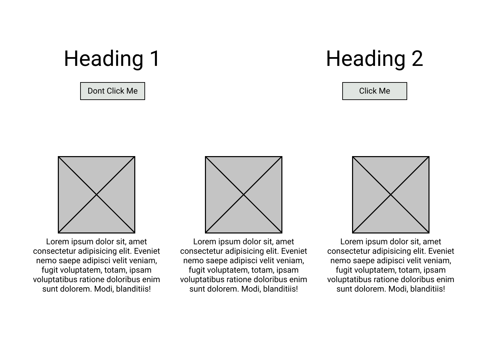
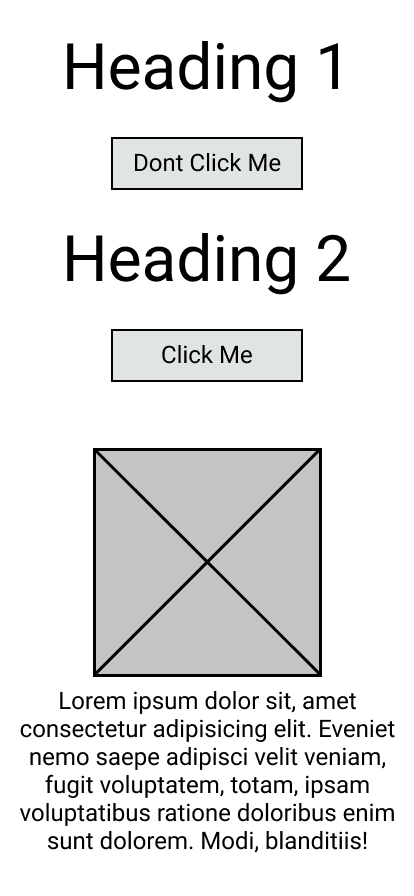
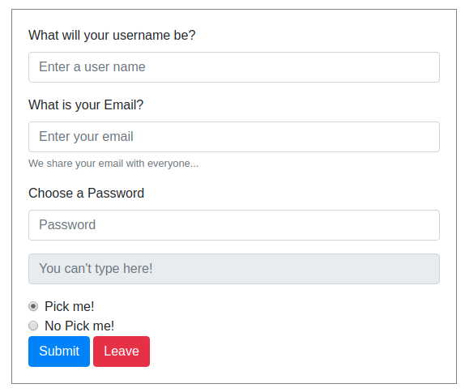

# Bootstrap
## Learning Goals
 - I can link Bootstrap into my project.
 - I can find and search through the bootstrap documentation.
 - I can use the grid system to create a responsive web page.
 - I can modify a Bootstrap component.

## Resources
 - [Bootstrap Grid System](https://getbootstrap.com/docs/4.4/layout/grid/)
 - [Bootstrap Getting Started](https://getbootstrap.com/docs/4.4/getting-started/introduction/) 
 - [Bootstrap Buttons](https://getbootstrap.com/docs/4.0/components/buttons/) 
 - [Boostrap Forms](https://getbootstrap.com/docs/4.0/components/forms/) 

## What is Bootstrap?
Bootstrap was created at Twitter to help give internal tools a consistent look. It is a CSS framework for building responsive, mobile-first Web pages. Bootstrap's primary goal is creating informative web pages, as opposed to Web Apps. Bootstrap provides a style definition for all HTML elements. This helps to give the website a uniform feel across all browsers, remember that different browsers will have different default styles. 

## Linking Bootstrap to your Project
[Bootstrap Getting Started](https://getbootstrap.com/docs/4.4/getting-started/introduction/)  
Bootstrap is primarily a CSS Framework; however, some components require extra JavaScript libraries to work. A list of these components can be found at the link above. For today we will just be using the CSS file. 
To add Bootstrap to our project, add this inside of the `<head>` tag. 
```<link rel="stylesheet" href="https://stackpath.bootstrapcdn.com/bootstrap/4.4.0/css/bootstrap.min.css" integrity="sha384-SI27wrMjH3ZZ89r4o+fGIJtnzkAnFs3E4qz9DIYioCQ5l9Rd/7UAa8DHcaL8jkWt" crossorigin="anonymous">``` 
This works in the same manner that we have been using to add our local CSS files; only this time, it is linking to a resource that is stored in the cloud.
You should see that once we add this link and refresh our page, the style of our page has been updated. 

## Bootstrap 12 Grid System
Bootstrap's Grid system uses rows, columns, and containers to create layouts and align content. It built using FlexBox and used what is known as a '12 Column Grid'. It is a way of breaking down our page into sections of different widths. It also gives us the ability to change how much space a section should take and different view sizes (i.e., a different Layout for Web and for mobile.) 


## Creating a Layout with Bootstrap
The outermost element on the page is going to be a Boostrap container div `<div class="container">` all of our layout will be nested inside this div. In this div we can set a row `<div class="row">` and then set columns inside that row. All of our content must be placed inside of a column div. It is important to use this order and format as thats how the Bootstrap layout works. 
```html
<div class="container">
 <div class="row">
 <div class ="col">
 <p>Hello World!<p>
 </div>
 </div>
</div>
```

Bootstrap will automatically divide your row to fit the number of columns you have. This will work for all devices and viewports. 
```html
<div class="container">
 <div class="row">
 <div class="col fill-red">
 Column 1 of 2
 </div>
 <div class="col fill-green">
 Column 2 of 2
 </div>
 </div>
 <div class="row">
 <div class="col fill-yellow">
 Column 1 of 3
 </div>
 <div class="col fill-green">
 Column 2 of 3
 </div>
 <div class="col fill-red">
 Column 3 of 3
 </div>
 </div>
</div>
```
Some times you will will want to specify exactly how much space a certain part of you page takes up. For this we can add a screen size and width to the column class.
The naming convention for boostrap columns is: 
`col` - "size" - "number of spaces" 
So `col-sm-6` would mean, that on a small viewport (576px - 768px) take up 6 column slots.
|Size| Prefix | Max Width | Size Range |
|---|---|---|---|
|Extra Large | `col-xl` |1140px| > 1200px|
|Large| `col-lg` |960px| > 992px|
|Medium| `col-md`|720px| > 768px |
| Small |`col-sm`|540px |> 578px|
|Extra Small | `col-xs` | none (auto) | < 578px|
All columns have a 15px 'gutter' on either side, so allow an extra 30px if making a tightly aligned design.

By default, Bootstrap will try to squeeze content to fit inside of a row. You can specify how many rows coulumns a row has to make the content wrap.
```html
<div class="container">
 <div class="row row-cols-3">
 <div class="col fill-red">Column</div>
 <div class="col fill-yellow">Column</div>
 <div class="col fill-red">Column</div>
 <div class="col fill-yellow">Column</div>
 </div>
</div>
```

## Buttons
[Bootstrap Buttons](https://getbootstrap.com/docs/4.0/components/buttons/)  
Bootstrap also comes with a collection of components that we can add to a project right away. One useful one is the button component.
```html
<button type="button" class="btn">Im a Button!</button>
```
You might notice this button doesn't look like much; bootstrap buttons follow a special naming style that defines the purpose for each button.
```html
<button type="button" class="btn btn-success">Success</button>
<button type="button" class="btn btn-danger">Danger</button>
```
## Overriding styles
Although Bootstrap provides a basic style for each HTML element, we can override this style and give it our own. To make sure that our style is the one that displays, we need to add the `!important.` keyword after defining our property.
```css
.change-color {
 background-color: purple !important;
}
```
With great power comes great responsibility. `!important` will override all previous styles, even inline styles. 'Important' is best used sparingly as it can be tough to debug if multiple classes are competing to style a single element.

## Challenge 1
cd into the `challenge1` directory. In there, you will find `layout.html`. The page has the HTML elements created, but they are all over the place! Using Bootstrap, refactor the layout to resemble these wireframes for mobile and desktop. You will need to link to the Bootstrap CDN to the file. Using the bootstrap button component, give the `don't click` buttons a danger color and the `click me` button a success color. Make sure that the layout changes when displayed on a mobile device or on a desktop.

### Desktop

### Mobile


# Challenge 2 - Beast Mode
[Boostrap Forms](https://getbootstrap.com/docs/4.0/components/forms/)  
Part of becoming a good developer is learning to read documentation to be able to implement a new idea or technology in your code. For this challenge, I want you to follow the link above to research the form component and the use that knowledge to create a form that looks like the image below. 



